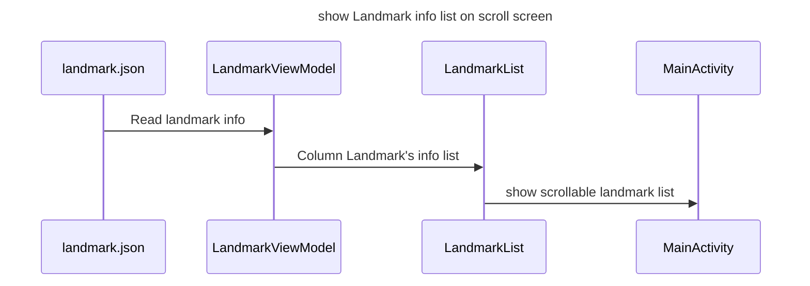
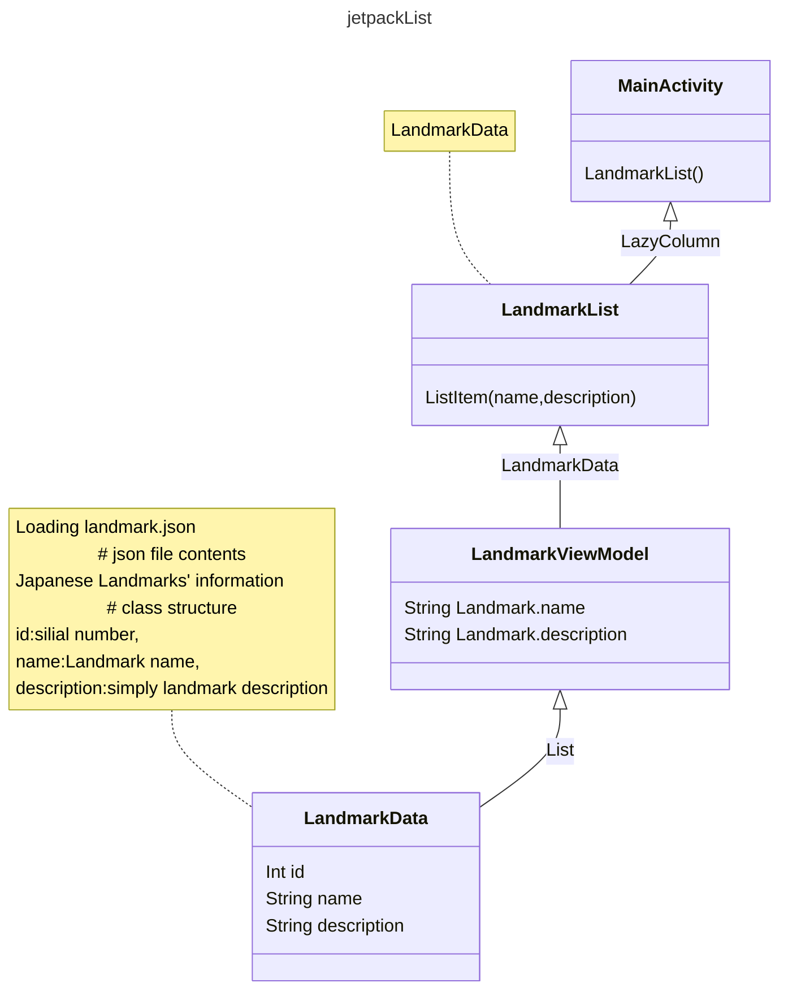
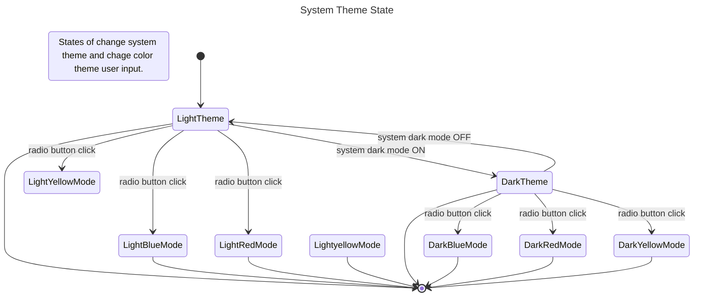

# jetpackList

**現代的なAndroid開発技術を学習するための日本観光地アプリ**

[](https://android.com)
[](https://kotlinlang.org)
[](https://developer.android.com/jetpack/compose)
[](https://m3.material.io)

日本の39箇所の観光地情報を表示するAndroidアプリケーションです。Jetpack ComposeとMaterial Design 3を使用し、多言語対応（日本語、韓国語、中国語、スペイン語、英語）とテーマ機能を実装しています。

## 📱 機能一覧

### 実装済み機能
- ✅ **観光地一覧表示**: LazyColumnによるスクロール可能なリスト（39箇所の日本観光地）
- ✅ **詳細画面**: 観光地の詳細情報と最寄り空港情報表示
- ✅ **多言語対応**: 5言語サポート（ja, ko, zh, es, en）
- ✅ **お気に入り機能**: 星アイコンによる視覚的表示とフィルター切り替え
- ✅ **基本テーマ対応**: システムダークモード、Dynamic Color（Android 12+）

### 実装予定機能
- 🔄 **完全なテーマシステム**: ライト/ダーク + 4色テーマ（デフォルト、青、赤、黄）
- 🔄 **データ永続化**: お気に入り状態の保存
- 🔄 **設定画面**: テーマ選択とアプリ設定
- 🔄 **エラーハンドリング**: ネットワークエラー等の適切な処理

## 🏗️ 技術スタック

### 現在の実装
| カテゴリ | 技術 | バージョン |
|----------|------|------------|
| 言語 | Kotlin | 1.9.0 |
| UI Framework | Jetpack Compose | 2023.08.00 |
| アーキテクチャ | MVVM | - |
| 状態管理 | LiveData | - |
| ナビゲーション | Navigation Compose | 2.7.7 |
| データ形式 | JSON + Gson | 2.11.0 |
| テスト | JUnit 5 | 5.8.1 |

### 推奨改善スタック
| カテゴリ | 現在 | 推奨 |
|----------|------|------|
| 状態管理 | LiveData | **StateFlow** |
| データ層 | 直接JSON読み込み | **Repository Pattern** |
| 永続化 | なし | **Room + DataStore** |
| 依存性注入 | なし | **Hilt** |
| テスト | 基本Unit Test | **包括的テスト戦略** |

## 🏛️ アーキテクチャ

### 現在のアーキテクチャ
```
┌─────────────────┐
│   MainActivity  │  ← エントリーポイント
├─────────────────┤
│ LandmarkList    │  ← LazyColumn実装
│ LandmarkDetail  │  ← 詳細画面
├─────────────────┤
│LandmarkViewModel│  ← LiveData使用
├─────────────────┤
│   Data Layer    │  ← JSONファイル直接読み込み
│ (JSON + Gson)   │
└─────────────────┘
```

### 推奨アーキテクチャ
```
┌─────────────────┐
│   Presentation  │  ← Compose UI + StateFlow
├─────────────────┤
│    Domain       │  ← Use Cases + Repository Interface
├─────────────────┤
│      Data       │  ← Repository Impl + DataSources
├─────────────────┤
│   Infrastructure │  ← Room DB + DataStore + Assets
└─────────────────┘
```

## 📊 システム設計図

### Landmark List Sequence Diagram


```mermaid

---
title: show Landmark info list on scroll screen
---

sequenceDiagram
landmark.json->>LandmarkViewModel:Read landmark info
LandmarkViewModel->>LandmarkList: Column Landmark's info list
LandmarkList->>MainActivity: show scrollable landmark list

```

### Landmark List Class Diagram


```mermaid

---
title: jetpackList
---

classDiagram
 MainActivity <|-- LandmarkList :LazyColumn
 LandmarkList <|-- LandmarkViewModel : LandmarkData
 LandmarkViewModel <|-- LandmarkData: List
 note for LandmarkList " LandmarkData "

 note for LandmarkData " Loading landmark.json 
 # json file contents
 Japanese Landmarks' information
 # class structure
 id:silial number,
 name:Landmark name,
description:simply landmark description
 "

class MainActivity {
    LandmarkList()
}

class LandmarkList {
     ListItem(name,description)
}

class LandmarkViewModel {
    String Landmark.name
    String Landmark.description
}

class LandmarkData {
    Int id
    String name
    String description
}

```

### Theme State


```mermaid
---
title: System Theme State
---

stateDiagram-v2

s2 : States of change system theme and chage color theme user input.

[*] --> LightTheme

LightTheme --> [*]

LightBlueMode -->[*]
LightRedMode -->[*]
LightyellowMode -->[*]

DarkTheme --> [*]

DarkBlueMode --> [*]
DarkRedMode --> [*]
DarkYellowMode --> [*]

LightTheme --> DarkTheme: system dark mode ON

LightTheme --> LightBlueMode: radio button click
LightTheme --> LightRedMode: radio button click
LightTheme --> LightYellowMode: radio button click

DarkTheme --> LightTheme: system dark mode OFF

DarkTheme --> DarkBlueMode: radio button click
DarkTheme --> DarkRedMode: radio button click
DarkTheme --> DarkYellowMode: radio button click

```

## 🚀 開発ガイド

### セットアップ
```bash
git clone <repository-url>
cd jetpackList
./gradlew build
```

### 必要な環境
- Android Studio Hedgehog | 2023.1.1 以降
- JDK 17
- Android SDK 34
- Kotlin 1.9.0

### ビルドと実行
```bash
# デバッグビルド
./gradlew assembleDebug

# テスト実行
./gradlew test

# Lint チェック
./gradlew lint
```

## 🔧 現在の問題点と改善計画

### 🔴 高優先度（即座に対応が必要）

#### 1. 状態管理の改善
- **問題**: LiveData使用（StateFlowが推奨）
- **解決策**: StateFlowとUIStateパターンの導入
```kotlin
// 改善後の例
@HiltViewModel
class LandmarkViewModel @Inject constructor(
    private val landmarkRepository: LandmarkRepository
) : ViewModel() {
    private val _uiState = MutableStateFlow(LandmarkUiState())
    val uiState: StateFlow<LandmarkUiState> = _uiState.asStateFlow()
}
```

#### 2. データ永続化の欠如
- **問題**: お気に入り状態が保存されない
- **解決策**: Room Database + DataStore実装
```kotlin
// お気に入り永続化
@Entity(tableName = "favorites")
data class FavoriteEntity(
    @PrimaryKey val landmarkId: Int
)
```

#### 3. アーキテクチャの改善
- **問題**: Repository Pattern未実装、依存性注入なし
- **解決策**: Hilt + Repository Pattern導入
```kotlin
// Repository Pattern
interface LandmarkRepository {
    suspend fun getLandmarks(): Flow<List<LandmarkData>>
}
```

### 🟡 中優先度（次期実装）

#### 4. テスト戦略の強化
- **問題**: 基本的なUnit Testのみ
- **解決策**: UI Test、Integration Test追加
- **目標**: テストカバレッジ80%以上

#### 5. エラーハンドリング
- **問題**: 例外処理の統一なし
- **解決策**: Result型とエラーUI実装

### 🟢 低優先度（将来的改善）

#### 6. CI/CD・運用自動化
#### 7. セキュリティ強化
#### 8. パフォーマンス最適化

## 📈 改善ロードマップ（7週間計画）

### Phase 1: 基盤整備（Week 1-2）
- [ ] StateFlow migration
- [ ] Repository Pattern導入
- [ ] Room Database + DataStore実装
- [ ] エラーハンドリング

### Phase 2: 依存性注入とテスト（Week 3-4）
- [ ] Hilt導入
- [ ] Unit Test強化（80%カバレッジ）
- [ ] UI Test実装
- [ ] Integration Test

### Phase 3: UI/UX改善（Week 5）
- [ ] テーマ機能完成（4色テーマ）
- [ ] 設定画面実装
- [ ] アニメーション追加

### Phase 4: 最適化（Week 6）
- [ ] パフォーマンス改善
- [ ] LazyColumn最適化
- [ ] セキュリティ強化

### Phase 5: 運用準備（Week 7）
- [ ] CI/CD設定（GitHub Actions）
- [ ] ドキュメント整備
- [ ] リリース準備

## 🧪 テスト戦略

### 現在のテスト構成
```kotlin
// 基本的なUnit Test
class ExampleUnitTest {
    @Test
    fun addition_isCorrect() {
        assertEquals(4, 2 + 2)
    }
}
```

### 推奨テスト構成
```kotlin
// ViewModel Test
@ExtendWith(MockitoExtension::class)
class LandmarkViewModelTest {
    @Mock private lateinit var repository: LandmarkRepository
    // 包括的なテスト実装
}

// UI Test
@RunWith(AndroidJUnit4::class)
class LandmarkListTest {
    @get:Rule val composeTestRule = createComposeRule()
    // Compose UIテスト
}
```

### テスト目標
- **Unit Test カバレッジ**: 80% 以上
- **UI Test**: 主要フロー網羅
- **Integration Test**: Repository-Database間

## 🌐 多言語対応

| 言語 | コード | ファイル |
|------|--------|----------|
| 英語（デフォルト） | en | `Landmarks.json` |
| 日本語 | ja | `Landmarks_ja.json` |
| 韓国語 | ko | `Landmarks_ko.json` |
| 中国語（簡体字） | zh | `Landmarks_zh_rCN.json` |
| スペイン語 | es | `Landmarks_es_rES.json` |

## 🎨 テーマシステム

### 実装済み
- システムダークモード対応
- Dynamic Color（Android 12+）

### 実装予定
```kotlin
enum class ColorTheme {
    DEFAULT, BLUE, RED, YELLOW
}

@Composable
fun JetpackListTheme(
    colorTheme: ColorTheme,
    isDarkMode: Boolean,
    content: @Composable () -> Unit
) {
    val colorScheme = when {
        isDarkMode -> when (colorTheme) {
            ColorTheme.BLUE -> DarkBlueColorScheme
            ColorTheme.RED -> DarkRedColorScheme
            ColorTheme.YELLOW -> DarkYellowColorScheme
            else -> DarkColorScheme
        }
        // Light themes...
    }
}
```

## 🛠️ 実装予定の主要改善

### 1. StateFlow への移行
```kotlin
// Before (LiveData)
private val _landmarks = MutableLiveData<List<LandmarkData>>()
val landmarks: LiveData<List<LandmarkData>> = _landmarks

// After (StateFlow)
private val _uiState = MutableStateFlow(LandmarkUiState())
val uiState: StateFlow<LandmarkUiState> = _uiState.asStateFlow()
```

### 2. Repository Pattern 実装
```kotlin
@Singleton
class LandmarkRepositoryImpl @Inject constructor(
    private val assetDataSource: LandmarkAssetDataSource
) : LandmarkRepository {
    override suspend fun getLandmarks(): Flow<List<LandmarkData>> =
        flow { emit(assetDataSource.getLandmarks()) }
}
```

### 3. Room Database 実装
```kotlin
@Entity(tableName = "favorites")
data class FavoriteEntity(
    @PrimaryKey val landmarkId: Int,
    val createdAt: Long = System.currentTimeMillis()
)

@Dao
interface FavoriteDao {
    @Query("SELECT * FROM favorites")
    fun getAllFavorites(): Flow<List<FavoriteEntity>>
    
    @Insert(onConflict = OnConflictStrategy.REPLACE)
    suspend fun addFavorite(favorite: FavoriteEntity)
}
```

## 📊 品質指標

### コードメトリクス
- **テストカバレッジ**: 目標80%以上
- **循環複雑度**: 10以下
- **重複コード**: 5%以下

### パフォーマンス指標
- **アプリ起動時間**: 2秒以下
- **APKサイズ**: 50MB以下
- **メモリ使用量**: 適切な範囲

### ユーザー体験
- **クラッシュ率**: 0.1%以下
- **レスポンス時間**: 1秒以下
- **アクセシビリティ**: WCAG準拠

## 🤝 コントリビューション

### 開発フロー
1. Issueの作成
2. Feature branchの作成
3. 実装とテスト
4. Pull Request作成
5. コードレビュー
6. マージ

### コーディング規約
- [Kotlin Style Guide](https://kotlinlang.org/docs/coding-conventions.html)準拠
- [Android コーディング標準](https://source.android.com/setup/contribute/code-style)準拠
- ktlint使用推奨

## 📚 関連リソース

### 学習リソース
- [Jetpack Compose](https://developer.android.com/jetpack/compose)
- [Android Architecture](https://developer.android.com/topic/architecture)
- [Modern Android Development](https://developer.android.com/modern-android-development)

### 参考プロジェクト
- [Now in Android](https://github.com/android/nowinandroid)
- [Compose Samples](https://github.com/android/compose-samples)

## 📄 ライセンス

このプロジェクトはMITライセンスの下で公開されています。


**jetpackList** - 現代的なAndroid開発技術を学習しながら、美しい日本の観光地を探索しましょう！ 🏯🌸
