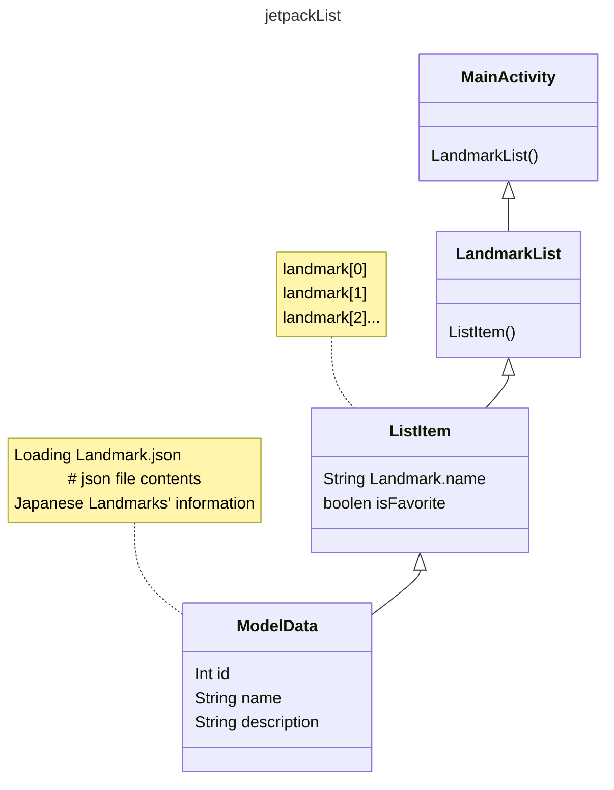
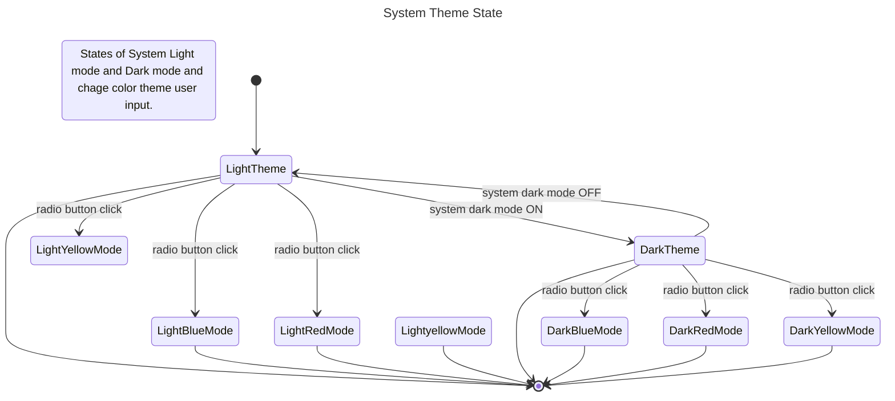

# jetpackList
lazy list and change theme

## functions
- show landmarks infomation list from json file.
- scroll view made from jetpack compose
- change app theme
    - dark mode 
    - light mode 
    - blue 
    - red
    - yellow

